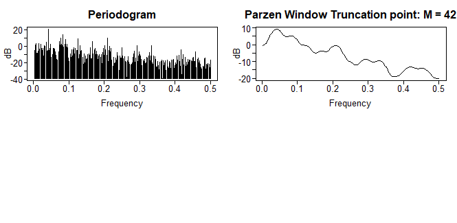
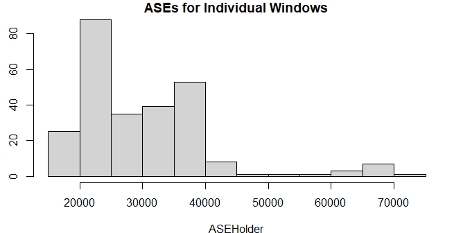
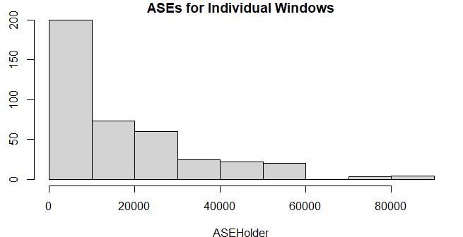

```{r library-imports, results='hide', message=FALSE, include=FALSE, echo=FALSE}

# Time Series Analysis
library(tseries)
library(forecast)
library(TSstudio)
library(tswge)
library(orcutt)
library(vars)

# Date Manipulation
library(lubridate)

# Metrics
library(MLmetrics)

# Correlation Matrix
library(ggcorrplot)

# Misc
library(tidyverse)
library(kableExtra)
library(knitr)
library(Hmisc)
library(gridExtra)

# Neural Networks
library(nnfor)

```


```{r load-data, results='hide', message=FALSE, include=FALSE, echo=FALSE}

setwd(".")

# use when knitting the pdf file
train <- read.csv("../../data/train.csv")
test <- read.csv("../../data/test.csv")

# use when running the code
# train <- read.csv("./data/train.csv")
# test <- read.csv("./data/test.csv")

# copy the test and train data sets for EDA
train.c1 <- train
test.c1 <- test

train.c1$datetime = ymd_hms(train.c1$datetime)
test.c1$datetime = ymd_hms(test.c1$datetime)

train.c1 <- train.c1 %>%
  mutate(year = as.factor(format(datetime, format = "%Y")),
         # month = as.factor(format(datetime, format = "%m")),
         month = month(train.c1$datetime, label = TRUE, abbr = FALSE),
         day = as.factor(format(datetime, format = "%d")),
         hour = as.factor(format(datetime, format = "%H")),
         season = factor(season, labels = c("Spring", "Summer", "Fall", "Winter")),
         holiday = factor(holiday, labels = c("No", "Yes")),
         workingday = factor(workingday, labels = c("No", "Yes")),
         weather = factor(weather, labels = c("Great", "Good", "Average", "Poor")))


test.c1 <- test.c1 %>%
  mutate(year = as.factor(format(datetime, format = "%Y")),
         # month = as.factor(format(datetime, format = "%m")),
         month = month(test.c1$datetime, label = TRUE, abbr = FALSE),
         day = as.factor(format(datetime, format = "%d")),
         hour = as.factor(format(datetime, format = "%H")),
         season = factor(season, labels = c("Spring", "Summer", "Fall", "Winter")),
         holiday = factor(holiday, labels = c("No", "Yes")),
         workingday = factor(workingday, labels = c("No", "Yes")),
         weather = factor(weather, labels = c("Great", "Good", "Average", "Poor")))


```

\pagebreak

# Introduction


Bike rentals where the customer can pick up and drop off a bike at their leisure at several locations has become popular. This dataset outlines attributes related to the travel of customers. Data gathered by the rental companies includes things like the date, temperature, count of users, humidity and more. The collection of attributes has the potential to assist researchers in developing an understanding of the mobility in a city. 


\pagebreak

# Data Analysis


The data collected for this project consists of hourly bike share rentals from January 1st, 2011 through December 31st, 2012.

There are 12 columns provided in the `train.csv` data set with 10,886 observations.  The `test.csv` data set has 6,493 records, or roughly 37% of the overall combined samples from the two files.  This is due to the fact that the training data consist of the first 19 days of each month and the test the remaining 11~12 days.  The test set does not include the response variables for casual, registered or total users.


  Column Name        |Type                  |Description
  -------------------|--------------------- |------------------------------------------------
  1.  datetime       |    Character         | YYYY-MM-DD HH24 (example:  2011-01-01 04:00:00)
  2.  season         |    Integer 		      | (1-4)
  3.  holiday        |    Integer 		      | (0 or 1)
  4.  workingday     |    Integer 		      | (0 or 1)
  5.  weather        |    Integer 		      | (1-4)
  6.  temp           |    Float 			      | temperature in Celsius
  7.  atemp          |    Float 			      | "feels like" temperature in Celsius
  8.  humidity       |    Integer           | relative humidity
  9.  windspeed      |    Float             | wind speed
  10. __casual__     |    Integer 		      | count of casual users 
  11. __registered__ |    Integer 		      | count of registered users 
  12. __count__      |    Integer 		      | count of total users (*primary response variable*)
  

\pagebreak


```{r histogram-hourly-bike-count-full, message=FALSE, echo=FALSE}

train.c1 %>%
  # mutate(price.mean = median(price)) +
  ggplot(aes(count)) +
  geom_histogram(bins = 150, alpha = 0.65) +
  ggtitle("Histogram of Hourly Bike Count") +
  labs(x = "Hourly Bike Count", y = "Totals per Bin") +
  theme(axis.text.x = element_text(angle = 90, hjust = 1))


```

The response variable of `count` appears to be heavily right-skewed, with the median value at ~145 users.  Additional summary statistics are show below.


```{r summary-count-full, message=FALSE, echo=FALSE}

knitr::kable(data.frame(as.array(summary(train.c1$count), "latex", booktabs = T))) %>%
  kable_styling(position = "center")


```

\pagebreak


```{r barplot-average-hourly-bike-count-by-month-full, message=FALSE, echo=FALSE}

train.c1 %>%
  remove_missing(na.rm = TRUE) %>%
  group_by(month) %>%
  ggplot(aes(x = month, y = count)) +
  geom_bar(position = "dodge", stat = "summary", fun = "mean") +
  ggtitle("Bar Plot of Average Hourly Bike Rentals by Month") +
  labs(x = "Month", y = "Average") + 
  theme(axis.text.x = element_text(angle = 90, hjust = 1))


```

June appears to be the month with heaviest demand.  

```{r boxplot-average-hourly-bike-count-by-month-full, message=FALSE, echo=FALSE}


train.c1 %>%
  ggplot(aes(x=month, y=count)) + 
  geom_boxplot() + 
  ggtitle("Box Plot of Bike Rentals by Month") +
  labs(x = "Month", y = "Average") + 
  theme(axis.text.x = element_text(angle = 90, hjust = 1))


# grid.arrange(ggplotGrob(plot1), ggplotGrob(plot2), ncol = 1, nrow = 2)
# grid.arrange(arrangeGrob(plot1, plot2), ncol = 1, nrow = 2)

```

It also appears to show relatively few outliers compared to months like January.


\pagebreak


```{r barplot-average-hourly-bike-count-by-season-full, message=FALSE, echo=FALSE}

train.c1 %>%
  remove_missing(na.rm = TRUE) %>%
  group_by(season) %>%
  ggplot(aes(x = season, y = count)) +
  geom_bar(position = "dodge", stat = "summary", fun = "mean") +
  ggtitle("Bar Plot of Average Hourly Bike Rentals by Season") +
  labs(x = "Season", y = "Average") + 
  theme(axis.text.x = element_text(angle = 90, hjust = 1))

```

Fall looks to have more rentals on average than the other seasons.

```{r boxplot-average-hourly-bike-count-by-season-full, message=FALSE, echo=FALSE}

train.c1 %>%
  ggplot(aes(x=season, y=count)) + 
  geom_boxplot() + 
  ggtitle("Box Plot of Bike Rentals by Season") +
  labs(x = "Season", y = "Average") + 
  theme(axis.text.x = element_text(angle = 90, hjust = 1))

```

\pagebreak


```{r barplot-average-hourly-bike-count-by-hour-full, message=FALSE, echo=FALSE}

train.c1 %>%
  remove_missing(na.rm = TRUE) %>%
  group_by(hour) %>%
  ggplot(aes(x = hour, y = count, fill=hour)) +
  geom_bar(position = "dodge", stat = "summary", fun = "mean") +
  ggtitle("Bar Plot of Average Bike Rentals by Hour") +
  labs(x = "Hour", y = "Average") + 
  theme(axis.text.x = element_text(angle = 90, hjust = 1))

```

The 5pm hour clearly has the highest peak compared to the other hours of the day.

```{r boxplot-average-hourly-bike-count-by-hour-full, message=FALSE, echo=FALSE}
train.c1 %>%
  ggplot(aes(x=hour, y=count, fill=hour)) + 
  geom_boxplot() + 
  ggtitle("Box Plot of Bike Rentals by Hour") +
  labs(x = "Hour", y = "Average") + 
  theme(axis.text.x = element_text(angle = 90, hjust = 1))
```

\pagebreak


```{r barplot-average-hourly-bike-count-by-weather-full, message=FALSE, echo=FALSE}

train.c1 %>%
  remove_missing(na.rm = TRUE) %>%
  group_by(weather) %>%
  ggplot(aes(x = weather, y = count)) +
  geom_bar(position = "dodge", stat = "summary", fun = "mean") +
  ggtitle("Bar Plot of Average Hourly Bike Rentals by Weather") +
  labs(x = "Weather", y = "Average") + 
  theme(axis.text.x = element_text(angle = 90, hjust = 1))

```

As expected, more riders are out when the weather is great, or better than average.


```{r boxplot-average-hourly-bike-count-by-weather-full, message=FALSE, echo=FALSE}

train.c1 %>%
  ggplot(aes(x=weather, y=count)) + 
  geom_boxplot() + 
  ggtitle("Box Plot of Bike Rentals by Weather") +
  labs(x = "Weather", y = "Average") + 
  theme(axis.text.x = element_text(angle = 90, hjust = 1))

```

Note the small spread of riders when the weather was listed as poor, even though the averages were consistent with other categories.

\pagebreak


```{r barplot-average-hourly-bike-count-by-workingday-full, message=FALSE, echo=FALSE}

train.c1 %>%
  remove_missing(na.rm = TRUE) %>%
  group_by(workingday) %>%
  ggplot(aes(x = workingday, y = count, fill=workingday)) +
  geom_bar(position = "dodge", stat = "summary", fun = "mean") +
  ggtitle("Bar Plot of Average Hourly Bike Rentals by Working Day") +
  labs(x = "Working Day", y = "Average") + 
  theme(axis.text.x = element_text(angle = 90, hjust = 1))

```

Surprisingly, whether or not the day was on a working day or not had little affect on the mean or median.

```{r boxplot-average-hourly-bike-count-by-workingday-full, message=FALSE, echo=FALSE}

train.c1 %>%
  ggplot(aes(x=workingday, y=count, fill=workingday)) + 
  geom_boxplot() + 
  ggtitle("Box Plot of Bike Rentals by Working Day") +
  labs(x = "Working Day", y = "Average") + 
  theme(axis.text.x = element_text(angle = 90, hjust = 1))

```


\pagebreak


```{r barplot-average-hourly-bike-count-by-holiday-full, message=FALSE, echo=FALSE} 

train.c1 %>%
  remove_missing(na.rm = TRUE) %>%
  group_by(holiday) %>%
  ggplot(aes(x = holiday, y = count, fill=holiday)) +
  geom_bar(position = "dodge", stat = "summary", fun = "mean") +
  ggtitle("Bar Plot of Average Hourly Bike Rentals by Holiday") +
  labs(x = "Holiday", y = "Average") + 
  theme(axis.text.x = element_text(angle = 90, hjust = 1))

```


The same was true for days falling on a holiday, it appeared to have little affect on the counts.

```{r boxplot-average-hourly-bike-count-by-holiday-full, message=FALSE, echo=FALSE}

train.c1 %>%
  ggplot(aes(x=holiday, y=count, fill=holiday)) + 
  geom_boxplot() + 
  ggtitle("Box Plot of Bike Rentals by Holiday") +
  labs(x = "Holiday", y = "Average") + 
  theme(axis.text.x = element_text(angle = 90, hjust = 1))

```


\pagebreak


```{r correlation-plot-full, message=FALSE, echo=FALSE, warning=FALSE}

train.c1.numeric <- train.c1 %>%
  select_if(is.numeric)

corr <- round(cor(train.c1.numeric), 1)
  
ggcorrplot(corr, method = "circle")


```


```{r flatten-corr-matrix-function-definition, results='hide', message=FALSE, include=FALSE, echo=FALSE}

# https://stackoverflow.com/questions/63359877/correlation-matrix-add-additional-column-of-adjusted-p-value

flattenCorrMatrix <- function(cormat, pmat) {
               ut <- upper.tri(cormat)
               data.frame(
               row = rownames(cormat)[row(cormat)[ut]],
               column = rownames(cormat)[col(cormat)[ut]],
               cor  =(cormat)[ut],
               p = pmat[ut]
               )
               }
```


The plot above shows a strong correlation between casual, registered and total (count) users.  We will use count as the primary response variable for our modeling, and discard the other secondary response variables.

Note that temp and atemp are also closely related to one another as would be expected.


```{r flatten-corr-matrix-output, message=FALSE, echo=FALSE}

# library(Hmisc)

train.c1.dropna <- train.c1.numeric %>% drop_na() # %>% dplyr::select(-one_of(c('count')))
res2 <- rcorr(as.matrix(train.c1.dropna))
flattenedCor <- flattenCorrMatrix(res2$r, res2$P) %>% arrange(desc(cor))
flattenedCor <- flattenedCor %>% filter(abs(cor) > 0.1) %>% dplyr::select(-one_of(c('p')))
names(flattenedCor) <- c('Feature 1','Feature 2','Correlation Coefficient')
knitr::kable(flattenedCor, "latex", booktabs = T) %>%
  kable_styling(position = "center")

```


\pagebreak

```{r linechart-hourly-bike-count-by-tempurature-full, message=FALSE, echo=FALSE}

train.c1 %>%
  ggplot(aes(x = temp, y = count)) + 
  geom_point(alpha = 0.3) + 
  geom_smooth() + 
  ggtitle("Line Chart of Counts by Tempurature") +
  labs(x = "Tempurature", y = "Count")
  
```

In general, recordings with warmer temperatures have more riders up to a threshold, which looks to start to decline around 34 degrees Celsius (~93 degrees Fahrenheit)

```{r linechart-hourly-bike-count-by-feels-like-tempurature-full, results='hide', message=FALSE, include=FALSE, echo=FALSE}
train.c1 %>%
  ggplot(aes(x = atemp, y = count)) + 
  geom_point(alpha = 0.3) + 
  geom_smooth() + 
  ggtitle("Line Chart of Counts by 'Feels Like' Tempurature") +
  labs(x = "'Feels Like' Tempurature", y = "Count")
  
```

\pagebreak

```{r linechart-hourly-bike-count-by-windspeed-full, results='hide', message=FALSE, include=FALSE, echo=FALSE}

train.c1 %>%
  ggplot(aes(x = temp, y = count)) + 
  geom_point(alpha = 0.3) + 
  geom_smooth() + 
  ggtitle("Line Chart of Counts by Wind Speed") +
  labs(x = "Wind Speed", y = "Count")
  
```

```{r linechart-hourly-bike-count-by-humidity-full, message=FALSE, echo=FALSE}

train.c1 %>%
  ggplot(aes(x = humidity, y = count)) + 
  geom_point(alpha = 0.3) + 
  geom_smooth() + 
  ggtitle("Line Chart of Counts by Humidity") +
  labs(x = "Humidity", y = "Count")
  
```

Humidity shows a negative trend, with recordings during high-humidity periods showing fewer riders.

\pagebreak

```{r train-june-2012, results='hide', message=FALSE, include=FALSE, echo=FALSE}

train.2012.june <-  train.c1 %>%
  filter(train.c1$year == 2012 & train.c1$month == "June")

```


```{r plot-timeseries-june-2012, message=FALSE, echo=FALSE}

ggplot(data=train.2012.june, aes(x = datetime, y = count)) +
      geom_line() + 
      ggtitle("Hourly Rental Trends for June 1st - June 19th, 2012") +
      labs(x = "Day", y = "Count") + 
      scale_x_datetime(date_breaks = "1 day", date_labels = "%d")

```

This plot shows the hourly bike rental counts for the first 19 days of June, 2019.

\pagebreak


# Methods

## ARMA Model


```{r plotts-sample-wge-june-2012, results='hide', message=FALSE, include=FALSE, echo=FALSE}

plotts.sample.wge(train.2012.june$count)

```


\pagebreak

```{r acf-june-2012, results='hide', message=FALSE, echo=FALSE}

plot(Acf(train.2012.june$count, lag.max = 50, plot = FALSE),  main = "Auto-Correlation Plot of Count")

```

Strong sinusoidal trend with a period of 24, which would likely reflect the hourly cycles from how the data was recorded.

\pagebreak

```{r plotts-parzen-wge-june-2012, results='hide', message=FALSE, include=FALSE, echo=FALSE}

plotts.parzen.wge(train.2012.june$count)

```

```{r plotts-parzen-wge-june-2012-plot, message=FALSE, echo=FALSE}

# use when knitting the pdf file


# use when running the code
# knitr::include_graphics('./images/spectral_density.png')


```


A peak can be seen in the spectral density at around 0.04.  Which would equate to a period of 24, which is what would be expected again from the frequency of our data set.  You can also visually confirm this from the number of cycles in the realization and divide that by the total number of observations.  (19 / 456 ~ 0.0417)  From there the period can be calculated with 1 / frequency.  (or ~24)


\pagebreak

```{r arma-seasonal-forecasts-june-2012-one, results='hide', message=FALSE, include=FALSE, echo=FALSE}

count.d24 = artrans.wge(train.2012.june$count, phi.tr = c(rep(0,23), 1))

plotts.sample.wge(count.d24)

# aic5.wge(count.d24, p=0:15, q=0:2, type = "aic") # AIC picks ARMA (10,0)

est.2012.june.d24 = est.arma.wge(count.d24, p=10, q=0)

est.2012.june.d24$phi
est.2012.june.d24$theta
est.2012.june.d24$avar

mean(train.2012.june$count)

plotts.wge(est.2012.june.d24$res)

```

```{r arma-seasonal-forecasts-june-2012-one-plot, results='hide', message=FALSE, include=FALSE, echo=FALSE}

plotts.sample.wge(count.d24)

```


```{r arma-seasonal-forecasts-june-2012-two, results='hide', message=FALSE, include=FALSE, echo=FALSE}

mean(train.2012.june$count)

df <- train.2012.june

no_ahead = 24

len_of_obs = length(df$datetime)

forecast.2012.june.d24 = fore.aruma.wge(df$count, s = 24, phi = est.2012.june.d24$phi, n.ahead = no_ahead, lastn = TRUE, limits = FALSE, plot = FALSE)

ase.arma.forecasts.one.day.s24 = mean((df$count[(len_of_obs - no_ahead + 1): len_of_obs] - forecast.2012.june.d24$f)^2)
ase.arma.forecasts.one.day.s24

rmse.arma.forecasts.one.day.s24 = RMSE(y_true = df$count[(len_of_obs - no_ahead + 1): len_of_obs], y_pred = forecast.2012.june.d24$f)
rmse.arma.forecasts.one.day.s24


```

```{r arma-seasonal-forecasts-june-2012-three, results='hide', message=FALSE, include=FALSE, echo=FALSE}

forecasts.arma.seasonal.one.day = round(forecast.2012.june.d24$f)
# set point forecast to 1 when less than 0
forecasts.arma.seasonal.one.day[forecasts.arma.seasonal.one.day < 0] <- 1

```


\pagebreak


```{r arma-seasonal-forecasts-june-2012-plot, message=FALSE, echo=FALSE, warning=FALSE}

df2 <- data.frame(real = df$count,
          pred = c(rep(NA,length(df$datetime)-length(data.frame(forecasts.arma.seasonal.one.day)[,1])),data.frame(forecasts.arma.seasonal.one.day)[,1]),
          time = df$datetime)

plot.arma.one.day.d24 <- ggplot(df2, aes(time, real, group = 1 )) +
  geom_line() + 
  geom_line(aes(time, pred, group = 1), color = "red")+
  ggtitle("1 Day Forecast (ARMA w/ S=24)") +
  labs(x = "Day", y = "Count") + 
  scale_x_datetime(date_breaks = "1 day", date_labels = "%d")

plot.arma.one.day.d24

```


An attempt to make the time series more stationary was made with a 24th order difference.  AIC recommended an ARMA(10,0) model on the residuals. We then fit the original data with the recommended phi's with a seasonal component to make for an ARIMA(10,0,0); s = 24 model.  As shown later in our write-up, the ARIMA model was not quite as effective as those without differencing or a seasonal adjustment.  It will therefore be removed from further analysis and comparisons to other models.

- **ASE** `r round(ase.arma.forecasts.one.day.s24, 3)`

- **RMSE** `r round(rmse.arma.forecasts.one.day.s24, 3)`


```{r aic5-wge-june-2012, results='hide', message=FALSE, include=FALSE, echo=FALSE}

# aic5.wge(train.2012.june$count, p=0:2, q=0:2, type = "aic") # BIC picks ARMA (15,0)
# aic5.wge(train.2012.june$count, p=24:26, q=0:2, type = "aic") # BIC picks ARMA (25,1)
# aic5.wge(train.2012.june$count, p=26:30, q=0:2, type = "bic") # BIC picks ARMA (26,0)

# aic5.wge(train.2012.june$count, p=24:26, q=0:5, type = "bic") # BIC picks ARMA (26,0)
# aic5.wge(train.2012.june$count, p=24:26, q=0:2, type = "aic") # BIC picks ARMA (26,4)

# aic5.wge(train.2012.june$count, p=0:15, q=0:2, type = "aic") # AIC picks ARMA (15,1)
# aic5.wge(train.2012.june$count, p=15:25, q=0:2, type = "aic") # AIC picks ARMA (24,2)
# aic5.wge(train.2012.june$count, p=26:30, q=0:2, type = "aic") # AIC picks ARMA (30, 1)

```


```{r factor-wge-june-2012, results='hide', message=FALSE, include=FALSE, echo=FALSE}

# factor.wge(c=(rep(0,7), 1))

```


<!-- $$\begin{equation} -->
<!--    (1-0.80B+0.15B^2+0.04B^3-0.05B^4+0.02B^5+0.09B^6-0.09B^7+0.30B^8-0.34B^9+0.10B^{10}+0.12B^{11}-0.06B^{12}+0.03B^{13} + 0.05B^{14}-0.09B^{15}+0.20B^{16}-0.16B^{17}+0.05B^{18}+0.10B^{19}-0.06B^{20}-0.003B^{21}+0.06B^{22}-0.13B^{23}-0.45B^{24}+0.31B^{25})(X_t - 287.18) = (1+0.30B)a_t; \sigma^2 = 5623.31 -->
<!-- \end{equation}$$ -->


```{r est-arma-wge-june-2012, results='hide', message=FALSE, include=FALSE, echo=FALSE}

est.2012.june = est.arma.wge(train.2012.june$count, p=25, q=1)
est.2012.june$phi
est.2012.june$theta
est.2012.june$avar
mean(train.2012.june$count)

```

```{r plot-residusals-est-june-2012, results='hide', message=FALSE, include=FALSE, echo=FALSE}

# plotts.wge(est.2012.june$res)

```


```{r arma-forecasts-seven-days-one, results='hide', message=FALSE, include=FALSE, echo=FALSE}

# 7 day forecast

df <- train.2012.june

no_ahead = 24 * 7

len_of_obs = length(df$datetime)

forecast.2012.june = fore.aruma.wge(df$count, phi = est.2012.june$phi, theta = est.2012.june$theta, n.ahead = no_ahead, lastn = TRUE, limits = FALSE, plot = FALSE)

# plot(df$count[1:len_of_obs], type = "l", xlab = "Time", ylab = "Count", main = "7 Day Forecast (ARMA)")
# lines(seq(289,456), forecast.2012.june$f, col = "red")

ase.arma.forecasts.seven.days = mean((df$count[(len_of_obs - no_ahead + 1): len_of_obs] - forecast.2012.june$f)^2)
ase.arma.forecasts.seven.days

rmse.arma.forecasts.seven.days = RMSE(y_true = df$count[(len_of_obs - no_ahead + 1): len_of_obs], y_pred = forecast.2012.june$f)
rmse.arma.forecasts.seven.days


```

```{r arma-forecasts-seven-days-two, results='hide', message=FALSE, include=FALSE, echo=FALSE}


forecasts.arma.25.1.seven.days = round(forecast.2012.june$f)
# set point forecast to 1 when less than 0
forecasts.arma.25.1.seven.days[forecasts.arma.25.1.seven.days < 0] <- 1

```


```{r arma-forecasts-seven-days-three, message=FALSE, echo=FALSE, warning=FALSE}

df2 <- data.frame(real = df$count,
          pred = c(rep(NA,length(df$datetime)-length(data.frame(forecasts.arma.25.1.seven.days)[,1])),data.frame(forecasts.arma.25.1.seven.days)[,1]),
          time = df$datetime)

plot.arma.seven.days <- ggplot(df2, aes(time, real, group = 1 )) +
  geom_line() + 
  geom_line(aes(time, pred, group = 1), color = "red")+
  ggtitle("7 Day Forecast (ARMA)") +
  labs(x = "Day", y = "Count") + 
  scale_x_datetime(date_breaks = "1 day", date_labels = "%d")

plot.arma.seven.days

```


- **ASE** `r round(ase.arma.forecasts.seven.days, 3)`

- **RMSE** `r round(rmse.arma.forecasts.seven.days, 3)`


```{r arma-forecasts-one-day-one, results='hide', message=FALSE, include=FALSE, echo=FALSE}

# 1 day forecast

df <- train.2012.june

no_ahead = 24

len_of_obs = length(df$datetime)

forecast.2012.june = fore.aruma.wge(df$count, phi = est.2012.june$phi, theta = est.2012.june$theta, n.ahead = no_ahead, lastn = TRUE, limits = FALSE, plot = FALSE)


ase.arma.forecasts.one.day = mean((df$count[(len_of_obs - no_ahead + 1): len_of_obs] - forecast.2012.june$f)^2)
ase.arma.forecasts.one.day

rmse.arma.forecasts.one.day = RMSE(y_true = train.2012.june$count[(len_of_obs - no_ahead + 1): len_of_obs], y_pred = forecast.2012.june$f)
rmse.arma.forecasts.one.day


```

```{r arma-forecasts-one-day-two, results='hide', message=FALSE, include=FALSE, echo=FALSE}

forecasts.arma.25.1.one.day = round(forecast.2012.june$f)
forecasts.arma.25.1.one.day[forecasts.arma.25.1.one.day < 0] <- 1

```

\pagebreak

```{r arma-forecasts-one-day-three, message=FALSE, echo=FALSE, warning=FALSE}

df2 <- data.frame(real = df$count,
          pred = c(rep(NA,length(df$count)-length(data.frame(forecasts.arma.25.1.one.day)[,1])),data.frame(forecasts.arma.25.1.one.day)[,1]),
          time = df$datetime)

plot.arma.one.day <- ggplot(df2, aes(time, real, group = 1 )) +
  geom_line() + 
  geom_line(aes(time, pred, group = 1), color = "red")+
  ggtitle("1 Day Forecast (ARMA)") +
  labs(x = "Day", y = "Count") + 
  scale_x_datetime(date_breaks = "1 day", date_labels = "%d")


plot.arma.one.day

```

- **ASE** `r round(ase.arma.forecasts.one.day, 3)`

- **RMSE** `r round(rmse.arma.forecasts.one.day, 3)`


```{r roll-win-ase-wge-function-definition, results='hide', message=FALSE, include=FALSE, echo=FALSE}

# series is the array of the series

# horizon is how far you want to predict into the future

# d is the order of the differencing: (1-B^)^d

# s is the order of the seasonality: (1-B^s)

# phis = order of the stationary AR term

# thetas = order of the invertible MA term

# It simply takes the given horizon and the model in the form of s,d,phis and
# thetas and figures out how many windows it can create in the data (series) and then calculates the ASE for each window.

#The output is the average off all the ASEs from each individual window.

roll.win.ase.wge = function(series, horizon = 1, s = 0, d = 0, phis = 0, thetas = 0) {
  
  trainingSize = length(phis) + length(thetas) + s + d + 1
  
  numwindows = length(series)-(trainingSize + horizon) + 1
  
  ASEHolder = numeric(numwindows)
  
  print(paste("Please Hold For a Moment, TSWGE is processing the Rolling Window ASE with", numwindows, "windows."))
  
  for( i in 1:numwindows) {
    invisible(capture.output(forecasts <- fore.aruma.wge(series[i:(i+(trainingSize-1))],phi = phis, theta = thetas, s = s, d = d,n.ahead = horizon)))
    ASE = mean((series[(trainingSize+i):(trainingSize+ i + (horizon) - 1)] - forecasts$f)^2)
    ASEHolder[i] = ASE
  }
  
  ASEHolder
  hist(ASEHolder, main = "ASEs for Individual Windows")
  WindowedASE = mean(ASEHolder)
  print("The Summary Statistics for the Rolling Window ASE Are:")
  print(summary(ASEHolder))
  print(paste("The Rolling Window ASE is: ",round(WindowedASE,3)))
  
  return(list(rwASE = WindowedASE, numwindows = numwindows, horizon = horizon, s = s, d = d, phis = phis, thetas = thetas))
}


```

\pagebreak

```{r roll-win-ase-wge-function-code, results='hide', message=FALSE, include=FALSE, echo=FALSE}

# roll.win.ase.wge(train.2012.june$count, horizon = 24*7, est.2012.june$phi, est.2012.june$theta, s = 0, d = 0)

```

### Long-Term Rolling Window ASE (7-Days)

```{r long-term-roll-win-ase-wge-function-output, message=FALSE, echo=FALSE}

# use when knitting the pdf file


# use when running the code
# knitr::include_graphics('./images/long_term_rolling_windows_ase.png')


```


- 30,053 (mean)
- 27,033 (median)


\pagebreak

### Short-Term Rolling Window ASE (1-Day)

```{r short-term-roll-win-ase-wge-function-output, message=FALSE, echo=FALSE}

# use when knitting the pdf file


# use when running the code
# knitr::include_graphics('./images/short_term_rolling_windows_ase.png')

```


- 17,002 (mean)
- 10,648 (median)


Note that the mean is much higher than the median, which would indicate a more skewed distribution as evidences by the chart above.


\pagebreak


## Vector Auto-Regressive (VAR) Model

### Cross-Correlation


```{r var-ccf-count-temp, message=FALSE, echo=FALSE}

plot(ccf(train.2012.june$temp, train.2012.june$count, lag.max = 25, plot = FALSE), main = "Cross-Correlation of Tempurature and Count")

# lag 0 = 0.473

```


\pagebreak


```{r var-ccf-count-humidity, message=FALSE, echo=FALSE}

plot(ccf(train.2012.june$humidity, train.2012.june$count, lag.max = 25, plot = FALSE), main = "Cross-Correlation of Humidity and Count")

# lag 0 = -0.535

```


\pagebreak


```{r var-ccf-count-weather, message=FALSE, echo=FALSE}

plot(ccf(train.2012.june$weather, train.2012.june$count, lag.max = 25, plot = FALSE), main = "Cross-Correlation of Weather and Count")

# lag 0 = -0.212

```


\pagebreak


```{r var-ccf-count-hour, message=FALSE, echo=FALSE}


plot(ccf(train.2012.june$hour, train.2012.june$count, lag.max = 25, plot = FALSE), main = "Cross-Correlation of Hour and Count")

# lag 21 = 0.642

```


```{r var-xbind, results='hide', message=FALSE, include=FALSE, echo=FALSE}

# train.2012.june$count <- log(train.2012.june$count)

# train.2012.june$temp <- scale(train.2012.june$temp, center = FALSE, scale = TRUE) 
# train.2012.june$humidity <- scale(train.2012.june$humidity, center = FALSE, scale = TRUE) 
# train.2012.june$windspeed <- scale(train.2012.june$windspeed, center = FALSE, scale = TRUE) 

X = cbind(train.2012.june$count, train.2012.june$temp, train.2012.june$humidity, train.2012.june$weather, train.2012.june$hour)
# X = cbind(train.c1$count, train.c1$temp, train.c1$humidity, train.c1$weather, train.c1$hour)

VARselect(X, lag.max = 24, type = "const", season = NULL, exogen = NULL)

```


```{r var-lsfit, results='hide', message=FALSE, include=FALSE, echo=FALSE}

lsfit = VAR(X, p = 22, type = "const", ic = c("AIC"))
# summary(lsfit)

```


\pagebreak

###  7 Day Forecast

```{r var-seven-days-forecast-one, results='hide', message=FALSE, include=FALSE, echo=FALSE}

no_ahead = 24*7

forecasts.var.seven.days = predict(lsfit, n.ahead = no_ahead)

```


```{r var-seven-days-forecast-two, results='hide', message=FALSE, include=FALSE, echo=FALSE}

forecasts.1.var.seven.days = forecasts.var.seven.days$fcst$y1[,1]

# set point forecast to 0 when less than 0
forecasts.1.var.seven.days[forecasts.1.var.seven.days < 0] <- 1

```

```{r var-seven-days-forecast-three, results='hide', message=FALSE, include=FALSE, echo=FALSE}

# no_ahead = 24*7

df <- train.2012.june

len_of_obs = length(df$datetime)

train_stop = len_of_obs - no_ahead
test_start = train_stop + 1

plot(df$count[1:len_of_obs], type = "l", xlab = "Time", ylab = "Count", main = "7 Day Forecast (VAR)")
lines(seq(test_start, len_of_obs), forecasts.1.var.seven.days, col = "red")

ase.var.forecasts.seven.days = mean((df$count[test_start:len_of_obs] - forecasts.1.var.seven.days)^2)
ase.var.forecasts.seven.days

rmse.var.2012.seven.days = RMSE(y_true = df$count[(len_of_obs - no_ahead + 1): len_of_obs], y_pred = forecasts.1.var.seven.days)
rmse.var.2012.seven.days

```


```{r var-seven-days-forecast-plot, message=FALSE, echo=FALSE, warning=FALSE}

df2 <- data.frame(real = df$count,
          pred = c(rep(NA,length(df$count)-length(data.frame(forecasts.1.var.seven.days)[,1])),data.frame(forecasts.1.var.seven.days)[,1]),
          time = df$datetime)

plot.var.seven.days <- ggplot(df2, aes(time, real, group = 1 )) +
  geom_line() + 
  geom_line(aes(time, pred, group = 1), color = "red")+
  ggtitle("7 Day Forecast (VAR)") +
  labs(x = "Day", y = "Count") + 
  scale_x_datetime(date_breaks = "1 day", date_labels = "%d")


plot.var.seven.days

```

- **ASE** `r round(ase.var.forecasts.seven.days, 3)`

- **RMSE** `r round(rmse.var.2012.seven.days, 3)`


\pagebreak

### 1 Day Forecast

```{r var-one-day-forecast-one, results='hide', message=FALSE, include=FALSE, echo=FALSE}
 
no_ahead = 24

forecasts.var.one.day = predict(lsfit, n.ahead = no_ahead)

```


```{r var-one-day-forecast-two, results='hide', message=FALSE, include=FALSE, echo=FALSE}

forecasts.1.var.one.day = forecasts.var.one.day$fcst$y1[,1]

# set point forecast to 0 when less than 0
forecasts.1.var.one.day[forecasts.1.var.one.day < 0] <- 1

```

```{r var-one-day-forecast-three, results='hide', message=FALSE, include=FALSE, echo=FALSE}

# no_ahead = 24

df <- train.2012.june

len_of_obs = length(df$datetime)

train_stop = len_of_obs - no_ahead
test_start = train_stop + 1

# plot(df$count[1:len_of_obs], type = "l", xlab = "Time", ylab = "Count", main = "1 Day Forecast (VAR)")
# lines(seq(test_start, len_of_obs), forecasts.1.var.one.day, col = "red")

ase.var.forecasts.one.day = mean((df$count[test_start:len_of_obs] - forecasts.1.var.one.day)^2)
ase.var.forecasts.one.day

rmse.var.forecasts.one.day = RMSE(y_true = df$count[(len_of_obs - no_ahead + 1): len_of_obs], y_pred = forecasts.1.var.one.day)
rmse.var.forecasts.one.day

```

```{r var-one-day-forecast-plot, message=FALSE, echo=FALSE, warning=FALSE}

df2 <- data.frame(real = df$count,
          pred = c(rep(NA,length(df$count)-length(data.frame(forecasts.1.var.one.day)[,1])),data.frame(forecasts.1.var.one.day)[,1]),
          time = df$datetime)

plot.var.one.day <- ggplot(df2, aes(time, real, group = 1 )) +
  geom_line() + 
  geom_line(aes(time, pred, group = 1), color = "red")+
  ggtitle("1 Day Forecast (VAR)") +
  labs(x = "Day", y = "Count") + 
  scale_x_datetime(date_breaks = "1 day", date_labels = "%d")


plot.var.one.day

```


- **ASE** `r round(ase.var.forecasts.one.day, 3)`

- **RMSE** `r round(rmse.var.forecasts.one.day, 3)`


\pagebreak

## Neural Network Model

###  7 Day Forecast

```{r mlp-seven-day-forecast, results='hide', message=FALSE, include=FALSE, echo=FALSE}

df <- train.2012.june

no_ahead = 24 * 7

len_of_obs = length(df$datetime)

train_stop = len_of_obs - no_ahead
test_start = train_stop + 1

# df$temp <- scale(df$temp, center = FALSE, scale = TRUE)
# df$humidity <- scale(df$humidity, center = FALSE, scale = TRUE)
# df$windspeed <- scale(df$windspeed, center = FALSE, scale = TRUE)

ts.count = ts(df$count[1:train_stop])
ts.count.x = data.frame(temp = ts(df$temp), humidity = ts(df$humidity),
                        weather = ts(df$weather), hour = ts(df$hour))

set.seed(42)

fit.mlp.seven.days = mlp(ts.count, hd = 5, xreg = ts.count.x, lags = no_ahead, xreg.lags = c(1,1,1,24), allow.det.season = FALSE)
plot(fit.mlp.seven.days)

forecasts.mlp.seven.days = forecast(fit.mlp.seven.days, h = no_ahead, xreg = ts.count.x)

# plot(df$count[1:len_of_obs], type = "l", xlab = "Time", ylab = "Count", main = "7 Day Forecast (MLP)")
# lines(seq(test_start, len_of_obs), forecasts.mlp.seven.days$mean, col = "red")

ase.mlp.forecasts.seven.days = mean((df$count[test_start:len_of_obs] - forecasts.mlp.seven.days$mean)^2)
ase.mlp.forecasts.seven.days

rmse.mlp.forecasts.seven.days = sqrt(mean((df$count[test_start:len_of_obs] - forecasts.mlp.seven.days$mean)^2))
rmse.mlp.forecasts.seven.days


```

```{r mlp-seven-day-forecast-plot, message=FALSE, echo=FALSE, warning=FALSE}

df2 <- data.frame(real = df$count,
          pred = c(rep(NA,length(df$count)-length(data.frame(forecasts.mlp.seven.days)[,1])),data.frame(forecasts.mlp.seven.days)[,1]),
          time = df$datetime)

plot.mlp.seven.days <- ggplot(df2, aes(time, real, group = 1 )) +
  geom_line() + 
  geom_line(aes(time, pred, group = 1), color = "red")+
  ggtitle("7 Day Forecast (MLP)") +
  labs(x = "Day", y = "Count") + 
  scale_x_datetime(date_breaks = "1 day", date_labels = "%d")


plot.mlp.seven.days

```

- **ASE** `r round(ase.mlp.forecasts.seven.days, 3)`

- **RMSE** `r round(rmse.mlp.forecasts.seven.days, 3)`


\pagebreak

### 1 Day Forecast

```{r mlp-one-day-forecast, results='hide', message=FALSE, include=FALSE, echo=FALSE}

df <- train.2012.june

no_ahead = 24

len_of_obs = length(df$datetime)

train_stop = len_of_obs - no_ahead
test_start = train_stop + 1

# df$temp <- scale(df$temp, center = FALSE, scale = TRUE)
# df$humidity <- scale(df$humidity, center = FALSE, scale = TRUE)
# df$windspeed <- scale(df$windspeed, center = FALSE, scale = TRUE)

ts.count = ts(df$count[1:train_stop])
ts.count.x = data.frame(temp = ts(df$temp), humidity = ts(df$humidity), 
                        weather = ts(df$weather), hour = ts(df$hour))

set.seed(42)

fit.mlp.one.day = mlp(ts.count, hd = 6, xreg = ts.count.x, lags = no_ahead, difforder = 0, allow.det.season = FALSE, sel.lag = FALSE)
plot(fit.mlp.one.day)

forecasts.mlp.one.day = forecast(fit.mlp.one.day, h = no_ahead, xreg = ts.count.x)

# plot(df$count[1:len_of_obs], type = "l", xlab = "Time", ylab = "Count", main = "1 Day Forecast (MLP)")
# lines(seq(test_start, len_of_obs), forecasts.mlp.one.day$mean, col = "red")

ase.mlp.forecasts.one.day = mean((df$count[test_start:len_of_obs] - forecasts.mlp.one.day$mean)^2)
ase.mlp.forecasts.one.day

rmse.mlp.forecasts.one.day = sqrt(mean((df$count[test_start:len_of_obs] - forecasts.mlp.one.day$mean)^2))
rmse.mlp.forecasts.one.day

```


```{r mlp-one-day-forecast-plot, message=FALSE, echo=FALSE, warning=FALSE}

df2 <- data.frame(real = df$count,
          pred = c(rep(NA,length(df$count)-length(data.frame(forecasts.mlp.one.day)[,1])),data.frame(forecasts.mlp.one.day)[,1]),
          time = df$datetime)

plot.mlp.one.day <- ggplot(df2, aes(time, real, group = 1 )) +
  geom_line() + 
  geom_line(aes(time, pred, group = 1), color = "red")+
  ggtitle("1 Day Forecast (MLP)") +
  labs(x = "Day", y = "Count") + 
  scale_x_datetime(date_breaks = "1 day", date_labels = "%d")


plot.mlp.one.day

```


- **ASE** `r round(ase.mlp.forecasts.one.day, 3)`

- **RMSE** `r round(rmse.mlp.forecasts.one.day, 3)`


\pagebreak

## Ensemble Model

### 7 Day Forecast

```{r ensemble-seven-day-forecast, results='hide', message=FALSE, include=FALSE, echo=FALSE}

forecasts.1.var.seven.days 
forecasts.mlp.seven.days

df.ensemble.seven.days <- data.frame(train.2012.june$count[289:456], forecasts.arma.25.1.seven.days, list(forecasts.1.var.seven.days), forecasts.mlp.seven.days)

colnames(df.ensemble.seven.days) <- c("Actual", "Predicted (ARMA)", "Predicted (VAR)", "Predicted (MLP)")

df.ensemble.seven.days <- df.ensemble.seven.days %>%
  mutate("Predicted (VAR)" = round(df.ensemble.seven.days$`Predicted (VAR)`)) %>%
  mutate("Predicted (MLP)" = round(df.ensemble.seven.days$`Predicted (MLP)`)) %>%
  mutate("Predicted (Ensemble)" = round((df.ensemble.seven.days$`Predicted (MLP)` + df.ensemble.seven.days$`Predicted (VAR)`)/2))

# df.ensemble.seven.days

```

```{r ensemble-seven-day-forecast-plot, message=FALSE, echo=FALSE}

knitr::kable(head(df.ensemble.seven.days, 30))

```

\pagebreak

###  1 Day Forecast

```{r ensemble-one-day-forecast, results='hide', message=FALSE, include=FALSE, echo=FALSE}

forecasts.1.var.one.day # = data.frame(forecasts.1.var.seven.days)
forecasts.mlp.one.day

df.ensemble.one.day <- data.frame(train.2012.june$count[433:456], forecasts.arma.25.1.one.day, list(forecasts.1.var.one.day), forecasts.mlp.one.day)

colnames(df.ensemble.one.day) <- c("Actual", "Predicted (ARMA)", "Predicted (VAR)", "Predicted (MLP)")

df.ensemble.one.day <- df.ensemble.one.day %>%
  mutate("Predicted (VAR)" = round(df.ensemble.one.day$`Predicted (VAR)`)) %>%
  mutate("Predicted (MLP)" = round(df.ensemble.one.day$`Predicted (MLP)`)) %>%
  mutate("Predicted (Ensemble)" = round((df.ensemble.one.day$`Predicted (MLP)` + df.ensemble.one.day$`Predicted (VAR)`)/2))


```

```{r ensemble-one-day-forecast-plot, message=FALSE, echo=FALSE}

knitr::kable(df.ensemble.one.day)

```

\pagebreak

# Results

## 7 Day Forecast


### ASE


```{r ensemble-seven-day-forecast-ase, message=FALSE, echo=FALSE}

ase.arma.forecasts.seven.days.rounded <- mean((df.ensemble.seven.days$`Actual` - df.ensemble.seven.days$`Predicted (ARMA)`)^2)

ase.var.forecasts.seven.days.rounded <- mean((df.ensemble.seven.days$`Actual` - df.ensemble.seven.days$`Predicted (VAR)`)^2)

ase.mlp.forecasts.seven.days.rounded <- mean((df.ensemble.seven.days$`Actual` - df.ensemble.seven.days$`Predicted (MLP)`)^2)

ase.ensemble.forecasts.seven.days.rounded <- mean((df.ensemble.seven.days$`Actual` - df.ensemble.seven.days$`Predicted (Ensemble)`)^2)

kable(data.frame('Model' = c('ARMA', 'VAR', 'MLP', 'Ensemble'), 
                 'ASE'= c(ase.arma.forecasts.seven.days.rounded, ase.var.forecasts.seven.days.rounded, ase.mlp.forecasts.seven.days.rounded, ase.ensemble.forecasts.seven.days.rounded)),
      "latex", booktabs = T)

```

### RMSE


```{r ensemble-seven-day-forecast-rmse, message=FALSE, echo=FALSE}

rmse.arma.forecasts.seven.days.rounded <- sqrt(mean((df.ensemble.seven.days$`Actual` - df.ensemble.seven.days$`Predicted (ARMA)`)^2))

rmse.var.forecasts.seven.days.rounded <- sqrt(mean((df.ensemble.seven.days$`Actual` - df.ensemble.seven.days$`Predicted (VAR)`)^2))

rmse.mlp.forecasts.seven.days.rounded <- sqrt(mean((df.ensemble.seven.days$`Actual` - df.ensemble.seven.days$`Predicted (MLP)`)^2))

rmse.ensemble.forecasts.seven.days.rounded <- sqrt(mean((df.ensemble.seven.days$`Actual` - df.ensemble.seven.days$`Predicted (Ensemble)`)^2))


kable(data.frame('Model' = c('ARMA', 'VAR', 'MLP', 'Ensemble'), 
                 'RMSE'= c(rmse.arma.forecasts.seven.days.rounded, rmse.var.forecasts.seven.days.rounded, rmse.mlp.forecasts.seven.days.rounded, rmse.ensemble.forecasts.seven.days.rounded)),
      "latex", booktabs = T)

```

\pagebreak

## 1 Day Forecast

### ASE


```{r ensemble-one-day-forecast-ase, message=FALSE, echo=FALSE}


ase.arma.forecasts.one.day.rounded <- mean((df.ensemble.one.day$`Actual` - df.ensemble.one.day$`Predicted (ARMA)`)^2)

ase.var.forecasts.one.day.rounded <- mean((df.ensemble.one.day$`Actual` - df.ensemble.one.day$`Predicted (VAR)`)^2)

ase.mlp.forecasts.one.day.rounded <- mean((df.ensemble.one.day$`Actual` - df.ensemble.one.day$`Predicted (MLP)`)^2)

ase.ensemble.forecasts.one.day.rounded <- mean((df.ensemble.one.day$`Actual` - df.ensemble.one.day$`Predicted (Ensemble)`)^2)

kable(data.frame('Model' = c('ARMA', 'VAR', 'MLP', 'Ensemble'), 
                 'ASE'= c(ase.arma.forecasts.one.day.rounded, ase.var.forecasts.one.day.rounded, ase.mlp.forecasts.one.day.rounded, ase.ensemble.forecasts.one.day.rounded)),
      "latex", booktabs = T)


```


### RMSE


```{r ensemble-one-day-forecast-rmse, message=FALSE, echo=FALSE}


rmse.arma.forecasts.one.day.rounded <- sqrt(mean((df.ensemble.one.day$`Actual` - df.ensemble.one.day$`Predicted (ARMA)`)^2))

rmse.var.forecasts.one.day.rounded <- sqrt(mean((df.ensemble.one.day$`Actual` - df.ensemble.one.day$`Predicted (VAR)`)^2))

rmse.mlp.forecasts.one.day.rounded <- sqrt(mean((df.ensemble.one.day$`Actual` - df.ensemble.one.day$`Predicted (MLP)`)^2))

rmse.ensemble.forecasts.one.day.rounded <- sqrt(mean((df.ensemble.one.day$`Actual` - df.ensemble.one.day$`Predicted (Ensemble)`)^2))


kable(data.frame('Model' = c('ARMA', 'VAR', 'MLP', 'Ensemble'), 
                 'RMSE'= c(rmse.arma.forecasts.one.day.rounded, rmse.var.forecasts.one.day.rounded, rmse.mlp.forecasts.one.day.rounded, rmse.ensemble.forecasts.one.day.rounded)),
      "latex", booktabs = T)


```


\pagebreak

# Appendix
 
## Solution One

Log Transform the response variable

\pagebreak
 
## Solution Two

Can additional data from previous month(s) aid in lowering the ASE and RMSE?  We will focus on using an MLP neural network with additional input features to test our hypothesis when forecasting the short-term counts for the month of June, 2012.


Including training data from May seemed to indicate that you could, albeit marginally as shown below, improve over the previous ARMA, VAR and MLP metrics that only used training data from June 2012.

However, attempting to use observations from more than 2 months out was detrimental to the model's performance.  

Due to our data not being continuous in the sense that we only have bike rental counts for the first 19 days of each month, we cannot make use of all of the available training data easily.

Although not a very likely example to be encountered in a real world setting, it does offer some evidence that having more available data to train your model with can offer benefits.  But having a continuous time-series and more observations would have been preferred.


```{r mlp-one-day-forecast-two, results='hide', message=FALSE, include=FALSE, echo=FALSE}


train.2012.may.june <-  train.c1 %>%
  filter(train.c1$datetime >= ymd_hms("2012-05-01 00:00:00"))

train.2012.may.june <-  train.2012.may.june %>%
  filter(train.2012.may.june$datetime < ymd_hms("2012-07-01 00:00:00"))


df <- train.2012.may.june


no_ahead = 24

len_of_obs = length(df$datetime)

train_stop = len_of_obs - no_ahead
test_start = train_stop + 1


ts.count = ts(df$count[1:train_stop])
ts.count.x = data.frame(temp = ts(df$temp), humidity = ts(df$humidity),
                        weather = ts(df$weather), hour = ts(df$hour), workingday = ts(df$workingday))


set.seed(42)

fit.mlp.one.day.2 = mlp(ts.count, hd = 6, xreg = ts.count.x, lags = 168, difforder = 0, allow.det.season = FALSE, sel.lag = FALSE, reps = 5)
plot(fit.mlp.one.day.2)

forecasts.mlp.one.day.2 = forecast(fit.mlp.one.day.2, h = no_ahead, xreg = ts.count.x)


ase.mlp.forecasts.one.day.2 = mean((df$count[test_start:len_of_obs] - forecasts.mlp.one.day.2$mean)^2)
ase.mlp.forecasts.one.day.2

rmse.mlp.forecasts.one.day.2 = sqrt(mean((df$count[test_start:len_of_obs] - forecasts.mlp.one.day.2$mean)^2))
rmse.mlp.forecasts.one.day.2

```


```{r mlp-one-day-forecast-two-plot, message=FALSE, echo=FALSE, warning=FALSE}

df2 <- data.frame(real = df$count,
          pred = c(rep(NA,length(df$count)-length(data.frame(forecasts.mlp.one.day.2)[,1])),data.frame(forecasts.mlp.one.day.2)[,1]),
          time = df$datetime)

plot.arma.one.day.2 <- ggplot(df2, aes(time, real, group = 1 )) +
  geom_line() + 
  geom_line(aes(time, pred, group = 1), color = "red")+
  ggtitle("1 Day Forecast (MLP)") +
  labs(x = "Day", y = "Count")


plot.arma.one.day.2

```


Our MLP model with both May and June training data resulted in an ASE score of `r round(ase.mlp.forecasts.one.day.2, 3)`.

And the RMSE stood at `r round(rmse.mlp.forecasts.one.day.2, 3)`.  Again, these are both improvements over previous short-term model forecasts.


